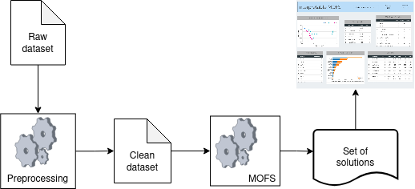

# DEMO: Interpreting Many-Objective Feature Selection (MOFS) Solutions
In this repository, you will find the codebase for the experiments of our proposed method for the interpretability of MOFS results.
Given a dataset, certain preprocessing is necessary to get it fit for feature selection. This includes dealing with missing and outlier values and normalising the data, as shown in the figure below.

